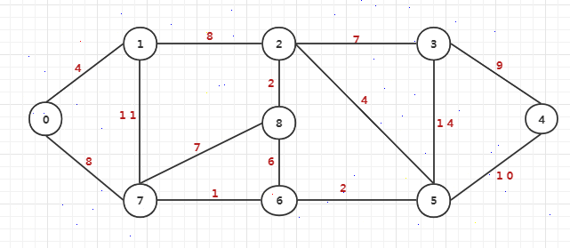

##### 一. Dijkstra算法（2022-05-04）
###### 1.题目：

如上图所示，线段的红色数字表示路径长度，现要计算从节点0到节点4的最短距离大小和最短距离对应的路径

###### 2.路径图表达
我们可以使用二维数组来表示路径图，如下图所示：

如上图所示，第一行和第一列表示节点，左下部分的数字就代表了路径的距离，和路径图是一一对应的，我们这里只用到的二维数据一半的空间，所以如果为了空间考虑，
可以将此二维数据转换为稀疏数组。

###### 3.算法步骤
首先创建一个int数组dis[], 数组的长度是图的节点的个数(如本题的例子，节点个数为9个),数组的下标代表节点编号0~8，数组的值**总是**代表节点0到
各节点的**最短距离**。所以dis的初始化是：
|   0    |   1   |    2   |   3   |    4   |   5   |   6    |   7   |    8   |
| :----: | :----:| :----: | :----:| :----: |:----: | :----: | :----:|  :----:| 
|   0    |   ∞   |   ∞    |   ∞   |   ∞    |   ∞   |   ∞    |   ∞   |   ∞    |
∞代表无穷大，我们代码用Integer.MAX_VALUE表示。初始节点0到自身的距离是0。
步骤1：**选定节点0**，与节点0直接相连的是节点1和节点7，距离分别是4和8， 因为4和8都小于无穷大，所以dis数组变更为：
|   0    |   1   |    2   |   3   |    4   |   5   |   6    |   7   |    8   |
| :----: | :----:| :----: | :----:| :----: |:----: | :----: | :----:|  :----:|
|   0    |   4   |   ∞    |   ∞   |   ∞    |   ∞   |   ∞    |   8   |   ∞    |
步骤2:因为节点0到节点1的距离是4， 节点0到节点7的距离是8,4<8,所以我们现在**选定节点1**，与节点1直接相连的是节点2和节点7，因为步骤1已经选定过了
节点0，所以需要将节点0排除在外，节点1与节点2的距离是8，节点0到节点2的距离是4+8=12，当前节点0到节点2的距离是无穷大，12<∞，所以更新dis数组节点0到节点2的距离是12；
节点1与节点7的距离是11，当前节点0到节点7的距离是4+11=15，当前节点0到节点7的距离是8，15>8,所以**不**更新dis数组节点0到节点7的距离；故dis数组更新为：
|   0    |   1   |    2   |   3   |    4   |   5   |   6    |   7   |    8   |
| :----: | :----:| :----: | :----:| :----: |:----: | :----: | :----:|  :----:|
|   0    |   4   |   12   |   ∞   |   ∞    |   ∞   |   ∞    |   8   |   ∞    |
步骤3 选7
|   0    |   1   |    2   |   3   |    4   |   5   |   6    |   7   |    8   |
| :----: | :----:| :----: | :----:| :----: |:----: | :----: | :----:|  :----:|
|   0    |   4   |   12   |   ∞   |   ∞    |   ∞   |   9    |   8   |   15   |
步骤3 选6
|   0    |   1   |    2   |   3   |    4   |   5   |   6    |   7   |    8   |
| :----: | :----:| :----: | :----:| :----: |:----: | :----: | :----:|  :----:|
|   0    |   4   |   12   |   ∞   |   ∞    |   11  |   9    |   8   |   14   |
步骤3 选5
|   0    |   1   |    2   |   3   |    4   |   5   |   6    |   7   |    8   |
| :----: | :----:| :----: | :----:| :----: |:----: | :----: | :----:|  :----:|
|   0    |   4   |   12   |  25   |   21   |   11  |   9    |   8   |   14   |
步骤3 选2
|   0    |   1   |    2   |   3   |    4   |   5   |   6    |   7   |    8   |
| :----: | :----:| :----: | :----:| :----: |:----: | :----: | :----:|  :----:|
|   0    |   4   |   12   |  19   |   21   |   11  |   9    |   8   |   14   |
步骤3 选8
|   0    |   1   |    2   |   3   |    4   |   5   |   6    |   7   |    8   |
| :----: | :----:| :----: | :----:| :----: |:----: | :----: | :----:|  :----:|
|   0    |   4   |   12   |  19   |   21   |   11  |   9    |   8   |   14   |
步骤3 选3
|   0    |   1   |    2   |   3   |    4   |   5   |   6    |   7   |    8   |
| :----: | :----:| :----: | :----:| :----: |:----: | :----: | :----:|  :----:|
|   0    |   4   |   12   |  19   |   21   |   11  |   9    |   8   |   14   |